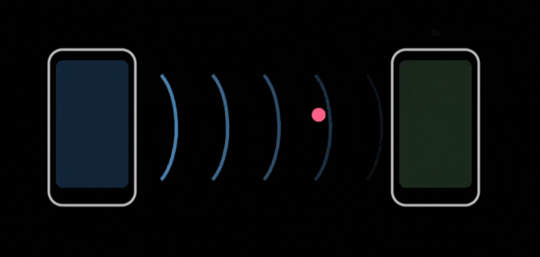

<p align="center">
  
</p>

<p align="center">Whisper</p>

<p align="center">
  
</p>

Whisper is a communication protocol designed for decentralized and secure data exchange using near-ultrasound acoustic waves. It enables devices to communicate in close proximity without relying on traditional wireless technologies such as Wi-Fi, Bluetooth, or cellular networks.

## Installation

Whisper provides flexible integration options for various platforms. Choose the one that fits your project best.

### Android-only

Add the dependency to your Android app's `build.gradle` file:

```kotlin
dependencies {
    implementation("io.github.shadadman:whisper-android:0.90.0")
}
```
Alternatively, you can build the Android AAR directly from the source.

Clone the repository:

```
git clone https://github.com/ShadAdman/Whisper.git
cd Whisper
```

Run the Gradle task:

`./gradlew whisper:assembleRelease`

The generated AAR can be found at:

`whisper/build/outputs/aar/`


### iOS-only (Swift Package Manager)

To integrate Whisper into your iOS project using Swift Package Manager, add the following repository URL in Xcode:

`https://github.com/ShadAdman/Whisper`


### JVM-only

For desktop or jvm applications, add the JVM dependency:

```kotlin
dependencies {
    implementation("io.github.shadadman:whisper-jvm:0.90.0")
}
```

Alternatively, you can include the standalone JAR file in your project's libs directory.

You can also build the JVM JAR directly from the source.

Clone the repository:

```
git clone https://github.com/ShadAdman/Whisper.git
cd Whisper
```

Run the Gradle task:

`./gradlew :whisper:desktopJar`

The generated JAR can be found at:

`whisper/build/libs/`

### Native-only (C/C++)

For native applications or embedded, you can build Whisper directly from the source repository and generate the required native headers and shared/static libraries.

> [!IMPORTANT]
> **Linux Build Requirement**: To build for Linux targets, you must have the ALSA and OpenSSL development headers installed on your system.
> On Ubuntu/Debian, run: `sudo apt-get install libasound2-dev libssl-dev`

Clone the repository:
```
git clone https://github.com/ShadAdman/Whisper.git
cd Whisper
```

To generate shared and static binaries use:

`./gradlew :whisper:linkReleaseSharedLinuxX64`

or:

`./gradlew :whisper:linkReleaseStaticLinuxX64`

The generated native binaries are placed under the:

`whisper/build/bin/`

### Kotlin Multiplatform Integration

If you are building a Kotlin Multiplatform project, add the dependency to your `commonMain` source set:

```kotlin
kotlin {
    sourceSets {
        commonMain.dependencies {
            implementation("io.github.shadadman:whisper:0.90.0")
        }
    }
}
```

## Core Concepts

To effectively use Whisper, it is helpful to understand the underlying principles that make acoustic data transfer possible.

### Acoustic Communication
Acoustic communication uses sound waves to transmit information. Whisper operates in the near-ultrasound frequency range, typically between 18 kHz and 22 kHz. These frequencies are generally inaudible to most adult humans but can be captured by standard device microphones and reproduced by speakers.

### FSK Modulation
Whisper uses Frequency Shift Keying (FSK) to represent data. In FSK, different frequencies are assigned to represent specific bit values. For example, one frequency might represent a binary 0, while another represents a binary 1. By switching between these frequencies over time, the protocol can encode a stream of data into a sound signal.

### Morse Code Protocol
Whisper includes an optional Morse Code transmission protocol. This is particularly useful for very low-bandwidth, high-reliability scenarios or for integration with legacy systems. 

> [!NOTE]
> **Data Encoding**: Since Morse code is traditionally text-based, Whisper converts binary data into a **Hexadecimal string** before Morse encoding it. For example, the byte `0x41` is represented as the string "41", which is then translated into Morse signals (`....-` and `.----`).

### DSP Pipeline (Powered by [Liquid DSP](https://github.com/jgaeddert/liquid-dsp))
Digital Signal Processing (DSP) is used to clean and prepare the audio signal before it is analyzed. Whisper leverages **[Liquid DSP](https://github.com/jgaeddert/liquid-dsp)**, a comprehensive and highly optimized software-defined radio (SDR) library. This allows us to employ a sophisticated pipeline that includes:
- **Windowing**: Breaking the continuous audio stream into manageable segments for analysis.
- **Bandpass Filtering**: Removing noise from frequencies outside the communication range (e.g., background speech or music).
- **Gain Control**: Normalizing the volume of the signal to ensure consistent detection.

By using [Liquid DSP](https://github.com/jgaeddert/liquid-dsp) as our engine, Whisper gains access to advanced modem designs, robust synchronization algorithms, and efficient filtering techniques that would be impractical to implement from scratch. This architectural choice ensures that Whisper is built on a battle-tested foundation, ready for future enhancements like higher-order modulations (PSK, QAM) or advanced channel equalization.

### Forward Error Correction (FEC)
Sound is an unstable medium for data transfer due to background noise and physical obstructions. Whisper includes Forward Error Correction to improve reliability. By sending redundant information along with the actual data, the receiving device can reconstruct the original message even if some parts of the acoustic signal were corrupted or lost.

## API Usage

The Whisper API is built using Kotlin Coroutines and Flows, providing a reactive way to handle data transmission and reception.

### Initialization and Configuration

The `Whisper` object serves as the primary entry point for the library. You can customize its behavior using `WhisperConfig`.

```kotlin
val config = WhisperConfig(
    sampleRate = 48000,
    carrierFrequency = 19000f,
    fecConfig = FecConfig(enabled = true, redundancy = 2),
    encryptionKey = "your-16-byte-key".encodeToByteArray(),
    encryptor = AesEncryptor(),
    protocolType = ProtocolType.MORSE
)

Whisper.configure(config)
```

The `WhisperConfig` class accepts the following parameters:

- **sampleRate**: The audio sampling rate in Hz. A value of 48000 Hz is recommended for most modern devices to ensure high-fidelity signal processing.
- **carrierFrequency**: The central frequency used for the acoustic signal, measured in Hz. By default, this is set to 19000 Hz, which resides in the near-ultrasound spectrum. This allows for communication that is typically inaudible to humans but recognizable by standard microphones.
- **protocolType**: Defines the transmission protocol to be used. Options include:
    - `ProtocolType.DEFAULT`: Uses high-speed FSK modulation (recommended for most use cases).
    - `ProtocolType.MORSE`: Uses Morse code encoding. Note that this is significantly slower and should only be used for small, non-time-sensitive payloads.
- **fecConfig**: This parameter handles the Forward Error Correction settings through the `FecConfig` class:
    - **enabled**: A boolean that determines whether error correction logic should be applied to the transmitted data.
    - **redundancy**: An integer that defines the level of data duplication. A higher value improves the chances of successful data recovery in environments with significant background noise, though it will increase the total time required for transmission.
- **encryptionKey**: (Optional) A `ByteArray` representing the secret key for encryption. When provided, Whisper will automatically encrypt/decrypt all transmitted and received data payloads.
- **encryptor**: (Optional) A `WhisperEncryptor` implementation. By default, it uses `SimpleXorEncryptor`. For production, `AesEncryptor()` is recommended as it uses platform-native hardware acceleration for secure communication.

### Receiving Data

To start listening for incoming signals, call `startListening()`. This initializes the audio engine and begins processing the microphone input. You can then collect data from the `receivedData` flow.

```kotlin
// Start the microphone and detection engine
Whisper.startListening()

// Observe incoming data
scope.launch {
    Whisper.receivedData.collect { data ->
        val message = data.decodeToString()
        println("Received: $message")
    }
}

// Stop listening when finished
Whisper.stopListening()
```

### Transmitting Data

Transmission is handled by the `transmit` function. It takes a byte array, encodes it into an acoustic signal, and plays it through the device speaker.

```kotlin
val message = "Hello from Whisper".encodeToByteArray()

scope.launch {
    Whisper.transmit(message)
}
```

### Testing and Debugging

You can use the `playTestTone()` function to verify that the audio hardware is working correctly. This will emit a 2-second tone at the configured carrier frequency.

```kotlin
scope.launch {
    Whisper.playTestTone()
}
```

### Monitoring Signal Events

If you need lower-level information about the signal state, such as when a carrier frequency is detected, you can observe the `carrierEvents` flow.

```kotlin
scope.launch {
    Whisper.carrierEvents.collect { event ->
        when (event) {
            is CarrierDetected -> println("Signal detected")
            is CarrierLost -> println("Signal lost")
        }
    }
}
```

## Sample Application

The project includes a comprehensive sample application located in the `sample` directory. This application demonstrates the core capabilities of the Whisper library using Compose Multiplatform.

Features of the sample app include:
- **Tone Detection**: Real-time visualization of detected frequencies and their magnitudes.
- **Data Transmission**: A simple interface to input text and transmit it as an acoustic signal.
- **Nearby Device Discovery**: Automatically lists the IDs of nearby devices that are currently transmitting.
- **Configurable FEC**: Allows users to toggle Forward Error Correction and adjust redundancy levels dynamically to see their impact on communication reliability.
- **Live Bit Stream**: Displays the raw bit stream being decoded from the acoustic signal in real-time.

You can run the sample app on Android, iOS, or Desktop to test the protocol between multiple devices.

## Technology Stack

Whisper is built on a modern, high-performance stack:
- **Kotlin Multiplatform**: For shared business logic and API surfaces across Android, iOS, Desktop, and Web.
- **[Liquid DSP](https://github.com/jgaeddert/liquid-dsp)**: A world-class C library for software-defined radio, providing the heavy-lifting for FSK modulation, synchronization, and error correction.
- **Compose Multiplatform**: Powering the documentation and sample applications.

While [Liquid DSP](https://github.com/jgaeddert/liquid-dsp) is a comprehensive library, its inclusion provides Whisper with a significant "future-proof" advantage. It allows us to rapidly evolve the protocol—moving from simple FSK to more complex waveforms or adding sophisticated adaptive filtering—without changing our core engine.

- **whisper**: The high-level API for application developers.
- **whisper-crypto**: Secure encryption layer (AES, XOR) for data payloads.
- **whisper-core**: Core data models and packet definitions.
- **whisper-dsp**: Digital signal processing logic, including filters and modems.
- **whisper-audio**: Platform-specific audio recording and playback implementations.
- **doc**: Documentation and landing page project.

## Requirements & Supported platforms

- **Android**: API Level 29 or higher.
- **iOS**: iOS 14.0 or higher.
- **Desktop**: support for Linux, macOS, and Windows.
- **Web**: (On the way) support via Kotlin/Wasm.
- **Native**: support for embedded devices.

## Where to?

Whisper isn't a replacement for Wi-Fi or Bluetooth; it's a specialized tool for specific environments where radio waves are impractical, unavailable, or insecure.

### Best Use Cases
- **Air-Gapped Sync**: Synchronize configuration or small files between devices in EMI-sensitive or high-security zones where RF is banned.
- **Initial Handshake**: Exchange Wi-Fi or Bluetooth credentials automatically by simply being in the same room, eliminating manual pairing.
- **Museum Guides**: Trigger location-specific audio or descriptions on a visitor's phone using ambient ultrasound emitters near exhibits.
- **Presence Proof**: Verify that a user is physically present at a location (like a check-in desk) without relying on spoofable GPS data.

### Software & App Ideas
- **WhisperGate**: A contactless entry system for offices or secure zones using standard phone speakers to transmit encrypted acoustic tokens.
- **SoundPay**: Offline micro-transactions in remote areas. Customers can pay by exchanging confirmation tokens via ultrasound even with zero cellular coverage.
- **EchoPass**: A proximity-based password manager that auto-fills credentials only when it "hears" your authorized mobile device nearby.

## What if?

### What if there is loud background noise?
Whisper uses a bandpass filter to ignore frequencies outside the 18-22 kHz range. Most environmental noise (talking, music, traffic) is below 15 kHz. However, extremely loud metallic noises or specialized ultrasound jammers can cause interference. In these cases, increasing the FEC redundancy is recommended.

### What if the devices are too far apart?
The effective range of Whisper is typically 1-5 meters depending on the speaker volume and microphone sensitivity. Sound follows the inverse square law, so signal strength drops rapidly with distance. If you need more range, you should lower the carrier frequency (closer to 17 kHz) or increase the transmission volume.

### What if I want to use Morse Code?
Morse code is available as an alternative protocol for highly reliable, low-bandwidth communication. 
> [!CAUTION]
> **Performance Impact**: Morse code is significantly slower than the default FSK protocol. Because binary data is encoded as Hexadecimal strings first, the transmission overhead is high. We recommend using Morse code only for short strings (e.g., "OK", "FAIL", or small status codes) or in extreme noise conditions where FSK might struggle.

### What if I want to send large files?
Whisper is optimized for low-bandwidth, high-reliability data like text, authentication tokens, or peer discovery info. Sending large files (megabytes) via sound is slow (approx. 100-500 bps). For large data, we recommend using Whisper to exchange Wi-Fi Direct or Bluetooth credentials, then switching to those high-speed channels.

### What if a user has hearing aids?
Some hearing aids can amplify high-frequency sounds. While Whisper operates near the edge of human hearing, users with sensitive equipment might hear a very faint 'whistle' or 'static'. We recommend providing a toggle in your app to disable acoustic features for accessibility.

### What if the signal reflects off walls?
Multipath interference is a common challenge in acoustic communication. Whisper's FSK modem includes guard intervals between symbols to allow echoes to die down before the next bit is processed, ensuring the decoder doesn't get confused by reflected waves.

### What if a user has pet?
Pets such as dogs or cats can hear high-frequency sounds. While Whisper operates near the edge of human hearing, animals might hear a very faint 'whistle' or 'static'. We recommend providing a toggle in your app to disable acoustic features for accessibility.

## How about Security?

Whisper provides built-in support for securing data payloads via the `whisper-crypto` module. By default, it supports:
- **AES (CBC with PKCS7 Padding)**: Uses platform-native hardware acceleration via `AesEncryptor()`.
- **Custom Encryptors**: Implement the `WhisperEncryptor` interface to use your own cryptographic algorithms.

While Whisper provides these tools, it is still proximity-based and operates over acoustic waves. Users should be aware that encrypted acoustic signals can still be recorded by nearby microphones, even if they cannot be easily decrypted.
